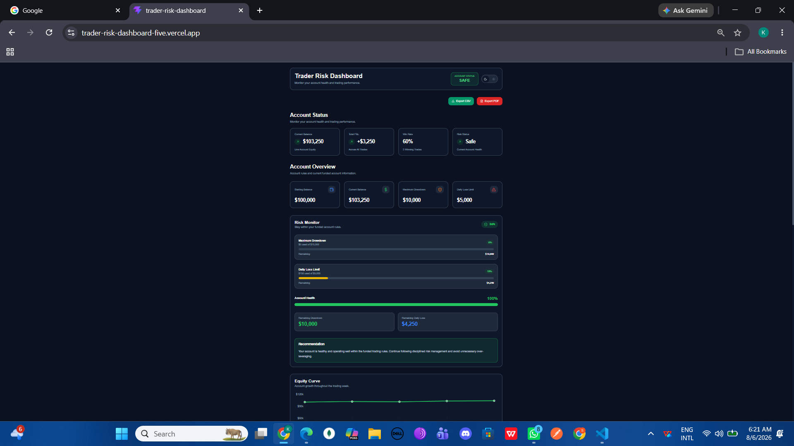
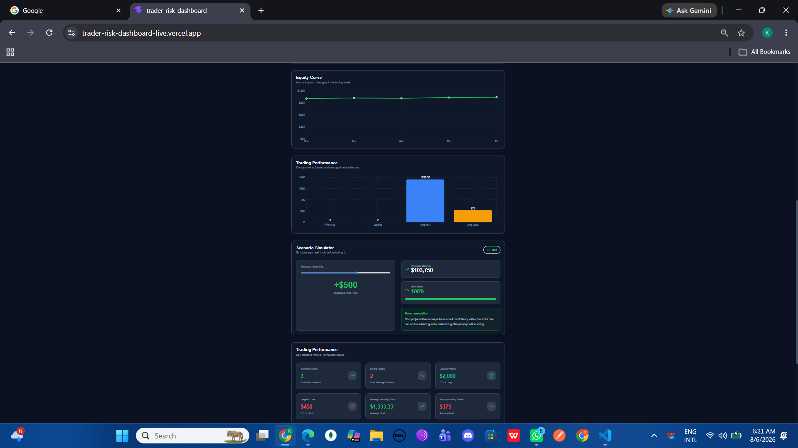
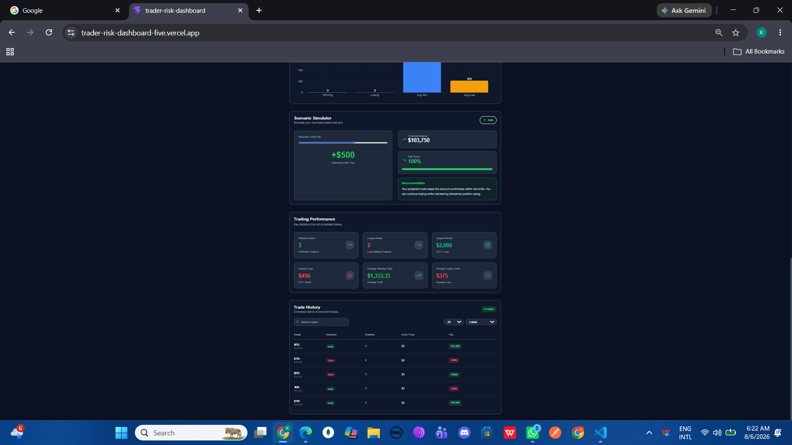
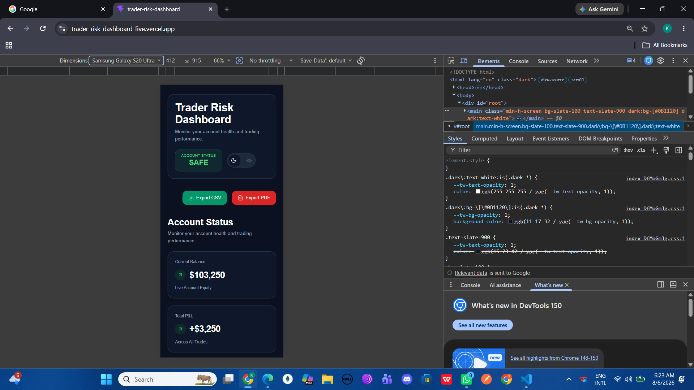

# Trdaer Risk Dashboard #

A responsive trading dashborad built with React and TypeScript that helps traders understand both their account performance and current risk exposure at a glance.

The dashboard calculates all metrics directly from the trade data instead of relying on the hardcoded values, making it easy to update and extend with new trades.

All trading metrics are calculated dynamically from the provided trade dataset. No calculated values are hardcoded.

# Live Demo #
https://trader-risk-dashboard-five.vercel.app

# Features #

- Fully responsive layout
- Optimized for desktop, tablet and mobile devices

## Account Overview #

- Starting Balance
- Current Balance
- Maximum Drawdown
- Daily Loss Limit

# Trading Performance #

The dashboard automatically calculates:

- Current Balance
- Total Profit & Loss
- Winning Trades
- Losing Trades
- Win Rate
- Largest Winning Trade
- Largest Losing Trade
- Average Winning Trade
- Average Losing Trade

All values are derived from the trade dataset.

# Risk Monitor #

The dashboard includes a dedicated risk monitoring section that helps traders understand whether they are close to violating funded account rules.

It displays:

- Current Drawdown
- Remaining Drawdown
- Current Day Loss
- Remaining Daily Loss
- Risk Score
- Account Status (Safe / Approaching Limit / At Risk)

A recommendation panel also provides guidance based on the current account condition.

#  Perfomance Analytics #

A bar chart compares:

- Winning Trades
- Losing Trades
- Average Winning Trade
- Average Losing Trade

This provides a quick visual comparison of trading performance.

# Trade History #
 The trade table includes:

 - Search by Asset or symbol
 - Asset Filtering
 - Trdae Sorting
 - Empty State when no Trades are avaialbale

 # Scenario simulator (product feature) #

 The additional feature I chose was a **Scenario Simulator**.

 Instead of only reviewing Previous trades, traders can simulate the profit  or loss of their next trade and instantly see how it affects:

 - Account Balance
 - Risk Score
 - Risk Status

 I chose this because traders often make decision based on future risk rather than historical performance. This features allows them to evaluate potential outcomes before placing another trade.

 ***The application follows a component-based architecture with reusable UI components and custom hooks for calculations and state management.***

 # Tech Stack #

 -React
 -TypeScript
 -Vite
 -Tailwind CSS
 -Recharts
 -Framer motion
 -Lucide React

 ***Mock trading data is used to simulate account performance and risk calculations.***

 # Project Structure #

 \---src
    +---analytics
    +---assets
    +---components
    |   +---AccountOverview
    |   +---AnimatedSection
    |   +---ExportButtons
    |   +---Header
    |   +---LoadingSkeleton
    |   +---OverviewCard
    |   +---OverviewCards
    |   +---PerformanceInsights
    |   +---RiskMonitor
    |   +---ScenerioSimulator
    |   +---Shared
    |   +---ThemeToggle
    |   +---TradeTable
    |   \---TradingPerformance
    +---constants
    +---context
    +---data
    +---features
    +---hooks
    +---pages
    +---types
    \---utils

# How To RUN #

Clone The repository

'''bash
git clone <repository-url>

Install the dependencies
```bash
npm install
```
Run the development server
```bash
npm run dev
```
Build the Production
```bash
npm run build
```
# Product Decision #

I decided to add a **Scenario Simulator** as the primary product feature.

A trader usually doesn't only want to know how they performed in the past—they also want to understand how their next trade could impact their account.

The simulator lets users experiment with different profit and loss values and immediately see how their account balance, risk score, and account status would change.

This helps traders make more informed decisions before entering a position.

# Product Questions #

1. What is drawdown in trading?

Drawdown represents the decline in an account's value from its highest point. It measures how much capital has been lost before the account starts recovering again.

2. Why is remaining drawdown more important than current P&L?

Current P&L only tells the trader whether they are currently making or losing money.

Remaining drawdown shows how much room is left before violating the account's risk rules. Even if a trader is profitable overall, they still need to manage their remaining risk carefully to avoid breaching funded account limits.

3. If you had another day to improve this dashboard, what would You add?

If I had another day, I would focus on making dashboard more useful for active traders by adding:

- Performance grouped by trading asset
- Trade journal with notes
- Best and worst trading days
- Monthly performance analytics
- Persistent theme preference
- Live trading API integration

# Edge Cases Handled #

- Empty trade history
- Search with no matching results
- Dynamic calculations from trade data
- Responsive layout across screen sizes

# Screenshots #






# Author #

Kalpana Kumari

Built As Part of the **TrdaerScape Full Satck Developer Assignment**.